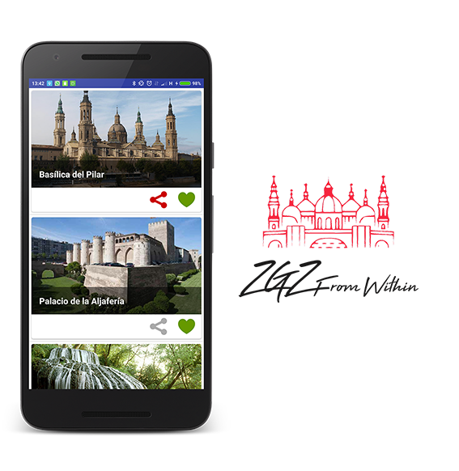

# ZgzFromWithin
Android application through which you can consult the most beautiful places in one of the most beautiful cities in the world: Zaragoza (Spain)

Libraries used in the project
------------------------------------
* [RxJava & RxAndroid][1]
* [Dagger 2][2]
* [AppCompat, CardView, RecyclerView and DesignLibrary][3]

[1]: https://github.com/ReactiveX/RxAndroid
[2]: https://github.com/google/dagger
[3]: http://developer.android.com/intl/es/tools/support-library/index.html

## Userful resources 

For the development, I'm following these two incredible developers

* [Uncle Bob - The Clean Architecture](https://blog.8thlight.com/uncle-bob/2012/08/13/the-clean-architecture.html)
* [Fernando Cejas - Clean Architecture Sample](https://github.com/android10/Android-CleanArchitecture)

License
-------

Copyright 2017 Jesus Manuel Lopez

 GNU GENERAL PUBLIC LICENSE
 Version 3, 29 June 2007

 Copyright (C) 2007 Free Software Foundation, Inc. <http://fsf.org/>
 Everyone is permitted to copy and distribute verbatim copies
 of this license document, but changing it is not allowed.
